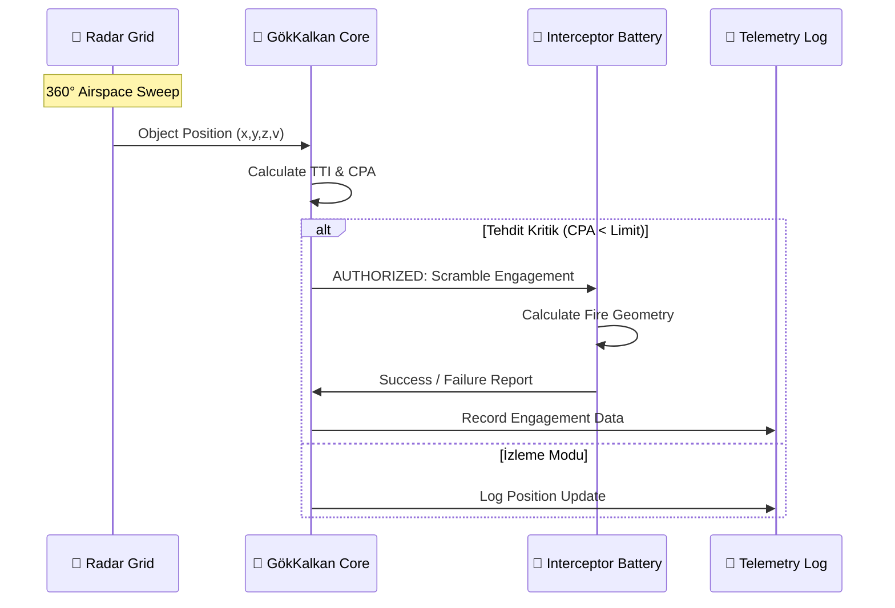

# 📐 GökKalkan AI - İleri Teknik Mimari ve Balistik Doktrini

## 1. Giriş
Bu doküman, GökKalkan AI sisteminin altında yatan matematiksel ve fiziksel temelleri detaylandırmak için hazırlanmıştır. Sistem, kinetik ve elektromanyetik verileri işleyerek otonom karar mekanizmalarını tetikler.

## 2. Balistik Tahmin Algoritmaları

### 2.1. Time To Impact (TTI) Hesaplaması
Hedefin merkeze (0,0,0) ulaşma süresi, hedefin pozisyon vektörü $\vec{P}$ ve hız vektörü $\vec{V}$ kullanılarak hesaplanır.

Denklem:
$$TTI = - \frac{\vec{P} \cdot \vec{V}}{|\vec{V}|^2}$$

Burada:
- $\vec{P} = (x, y, z)$
- $\vec{V} = (v_x, v_y, v_z)$
- $\vec{P} \cdot \vec{V} < 0$ ise hedef bataryaya yaklaşıyor demektir.

### 2.2. Closest Point of Approach (CPA)
Hedefin bataryaya en çok yaklaşacağı (teğet geçeceği) mesafedir. Hedefin doğrusal hareket ettiği varsayılır.

$$d_{CPA} = \frac{|\vec{P} \times \vec{V}|}{|\vec{V}|}$$

---

## 3. Sistem Akış Diyagramı

---

## 4. Yazılım Tasarım Kalıpları
Sistemde kullanılan bazı profesyonel kalıplar:
1.  **Singleton Pattern:** Radar ve Telemetri sistemleri tekil bir örnek üzerinden yönetilir.
2.  **Observer Pattern:** Radar her temas bulduğunda ana kontrol panelini uyarır.
3.  **Strategy Pattern:** Farklı tehdit tipleri (İHA vs Balistik Füze) için farklı engelleme stratejileri uygulanabilir.

## 5. Donanım Gereksinim Projeksiyonu
GökKalkan AI, gerçek dünya senaryolarında aşağıdaki donanım mimarisiyle entegre çalışacak şekilde tasarlanmıştır:
- **FPGA:** Gerçek zamanlı sinyal işleme (DSP).
- **GPU:** Yapay zeka tabanlı görüntü tanıma ve tehdit sınıflandırma.
- **Embedded Python:** Yüksek seviye mantık ve strateji katmanı.
